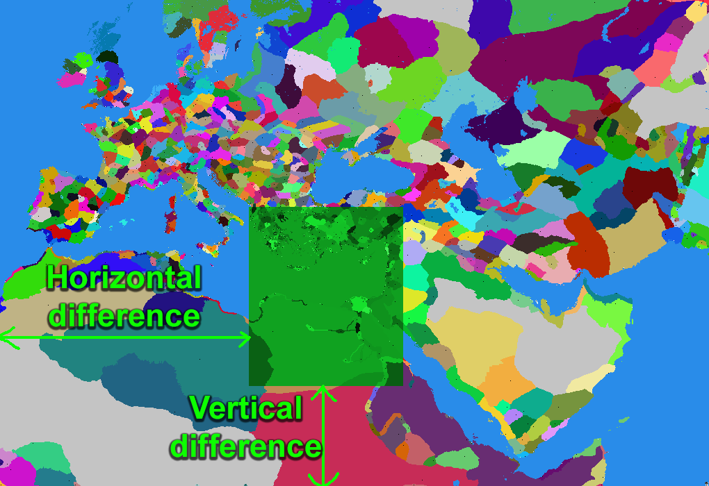

# RTW-mapping-tools
by Joostinian

Place all the required files next to the exe.

# RTW slaves resource generator

## Required files :

- **map_regions_flipped.tga** : a vertically flipped version of your map_regions.tga file,

Generates the descr_strat_slaves_new.txt file

# RTW region editor
by Joostinian
## Warning : doesn't support legion names, please remove all the legion lines from descr_regions before using this tool
## Required files :

- **map_regions.png**,
- **descr_regions.txt**,

for default values, leave the input empty.

Generates the descr_regions_new.txt file

# RTW map cropping tool
by Joostinian
## Required files :

- **map_regions.tga**,
- **descr_regions.txt**,
- **descr_strat_resources.txt** : the resources section of your descr_strat file

## Resources management guide : 

- Vertical difference : the number of pixels between the bottom of the original map and yours.
- Horizontal difference : the number of pixels between the left border of the original map and yours.

